# Awesome-Cloud-Integrated-Development-Environment-IDE

# Awesome-Cloud-Integrated-Development-Environment-IDE 💻 ☁️



  





  
  
  
  
  
  



---

## 🌟 Top Cloud Integrated Development Environment (IDE) Ecosystem

**Curated List of Commercial Cloud IDEs & Open-Source Kubernetes-Native Development Environments**  
*Focused on Browser-Based Coding, Pre-Configured Workspaces, Dev Container Standards, Collaborative Editing & Self-Hosted Cloud IDEs*

**Last updated: October 2026** 📅

---

### 📌 Overview & SEO Summary
Welcome to the ultimate curated directory of **cloud integrated development environments**, **open-source Kubernetes-native IDEs**, and **development environment automation frameworks**. The cloud IDE market has consolidated around a handful of platforms, with **Gitpod Classic sunsetting in favor of Ona** in October 2025 , **Google's Firebase Studio (formerly Project IDX) announcing discontinuation** effective March 2027 , and **AWS Cloud9 closing to new customers** while existing customers continue on the service . Whether you are looking for enterprise-grade commercial solutions (such as *GitHub Codespaces*, *Replit*, and *Ona*), or self-hostable open-source alternatives (like *Eclipse Che*, *Coder*, and *CodeCafé*), this list covers category leaders, Dev Container standards, and privacy-respecting cloud development.

---

## 📑 Table of Contents
- [🏢 SaaS & Commercial Platforms](#-saas--commercial-platforms)
- [🔓 Open-Source GitHub Projects](#-open-source-github-projects)
- [🛠️ How to Contribute](#%EF%B8%8F-how-to-contribute)
- [📊 Star History](#-star-history)
- [🤝 Support & Sponsorship](#-support--sponsorship)
- [⚠️ Disclaimer](#%EF%B8%8F-disclaimer)

---

## 🏢 SaaS / Commercial Platforms

The cloud IDE market is in **significant flux** as of October 2026. **AWS Cloud9** is no longer available to new customers, though existing users continue on the service . **Gitpod Classic** sunset its pay-as-you-go tier on October 15, 2025, and the platform has been **renamed to Ona** with a free tier and enterprise sales model . **Google's Firebase Studio** (formerly Project IDX) **began its shutdown phase on March 19, 2026**, with new workspace creation and account registration disabled on June 22, 2026, and **full service shutdown planned for March 22, 2027** . **Codeanywhere** has also been **sunsetted** according to its pricing page . This consolidation leaves **GitHub Codespaces** and **Replit** as the dominant general-purpose cloud IDEs, with **Ona** emerging as the enterprise-focused successor to Gitpod.

| SaaS / Commercial Platform | Company / Owner | Valuation / Market Cap | Standard Edition Starting Price | Free Tier / Free Trial Limits | Description |
| :--- | :--- | :--- | :--- | :--- | :--- |
| **[GitHub Codespaces](https://github.com/features/codespaces)** 🐙 | Microsoft / GitHub | ~$3.90 Trillion | **$0.18/core-hour** (2-core); storage **$0.07/GB-month** | **Free: 120 core-hours/month + 15 GB storage** | **Full VS Code in the browser** — **Dev Container support**, extensions, terminal, port forwarding. **2-core machine: ~60 real hours/month**; 4-core: ~30 real hours . **Student Developer Pack: 180 core-hours/month** . **The best web-based code editor for GitHub-centric workflows**. |
| **[Replit](https://replit.com/)** 🎮 | Replit Inc. | Private | **Core: $20/month** ($204/year); **Pro: $100/month**  | **Starter: free** with daily Agent allowance, 1 published app | **Browser-based IDE with AI Agent** — **Core includes $20 monthly credits**, 1 parallel Agent task, 5 collaborators, unlimited published apps . **Pro adds 10 parallel Agent tasks, up to 15 builders, credit rollover for 2 months** . **Teams plan sunset** — existing Teams users upgraded to Pro at no additional cost for remainder of term . |
| **[Ona (formerly Gitpod)](https://ona.com/)** 🦊 | Ona | Private | **Free tier available**; Enterprise via sales  | **Gitpod Classic PAYG sunset Oct 15, 2025**  | **Mission control for software projects** — **Dev Container-based specifications**. **Ona Automations** for services and tasks . **More powerful environments than Gitpod Classic**. **Free tier available**; enterprise sales for larger organizations . |
| **[AWS Cloud9](https://aws.amazon.com/cloud9/)** ☁️ | Amazon | ~$2.0 Trillion | **Pay-as-you-go** for underlying EC2 resources | **No new customers**; existing customers continue  | **AWS-native cloud IDE** — **No longer available to new customers** . Existing customers can continue using the service normally. **Amazon Linux 2023 support added July 2024** . |
| **[Codeanywhere](https://codeanywhere.com/)** 📦 | Codeanywhere | Private | **Sunsetted**  | **Service discontinued** | **Cloud IDE (discontinued)** — The platform has been **sunsetted** according to its pricing page . **Legacy users should plan migration** to supported alternatives. |
| **[Firebase Studio (formerly Project IDX)](https://firebase.google.com/studio)** 🔥 | Google (Alphabet) | ~$2.0 Trillion | **Free during shutdown** | **Shutdown planned March 22, 2027**  | **Online IDE (discontinued)** — **New workspace creation and account registration disabled June 22, 2026** . **Full shutdown planned March 22, 2027**. Google shifted focus to **Google AI Studio and other AI products** . |
| **[StackBlitz](https://stackblitz.com/)** ⚡ | StackBlitz | Private | **Free for individuals**; Enterprise custom | **Free: unlimited public projects** | **Browser-based IDE for web development** — Runs **Node.js entirely in browser via WebContainers**. **Best for Web services and frontend page debugging**. **Enterprise supports private NPM registries and SSO** . |
| **[Daytona](https://www.daytona.io/)** 🏎️ | Daytona | Private | **Pay-as-you-go: $0.0504/vCPU-hour**, $0.0162/GiB-hour  | **$200 free compute credit on signup**  | **Usage-based cloud development environments** — **Per-second billing** . **Sub-90ms sandbox cold starts**. **SDKs for Python, TypeScript, Ruby, Go, and Java**. **Startups program: up to $50K free credits** . |
| **[Red Hat CodeReady Workspaces](https://www.redhat.com/en/technologies/cloud-computing/codeready-workspaces)** 🎩 | Red Hat | ~$5 Billion | **Included with OpenShift subscription**  | **Free with OpenShift subscription** | **Kubernetes-native IDE** — **Based on Eclipse Che**, optimized for **Red Hat OpenShift and RHEL** . **Factories** for rapid project onboarding. **Uses Red Hat SSO instead of Keycloak**, RHEL8 base for security updates . **Enterprise-supported fork of Eclipse Che**. |

---

## 🔓 Open-Source GitHub Projects

*Sorted by GitHub_Stars_Count (Descending)* 🌟

- **[Eclipse Che](https://github.com/eclipse-che/che)**   
  **Kubernetes-native IDE and developer workspace server**, EPL-2.0 licensed. **The upstream project behind Red Hat CodeReady Workspaces** . **Runs in Kubernetes/OpenShift** — developers get containerized development environments with all dependencies pre-installed. **Devfile-based workspace configuration**. **Browser-based IDE with VS Code extensions**. **Note**: As of version 7.40, Eclipse Che **no longer releases updates through Operator Hub** for Kubernetes clusters . **The foundational open-source cloud IDE platform**. 🏛️

- **[Coder](https://github.com/coder/coder)**   
  **Self-hosted cloud development environments**, AGPL-3.0 licensed. **"The Cloud IDE, Solved"** . **Provisions remote development environments** on your own infrastructure (AWS, GCP, Azure, or bare metal). **VS Code in the browser**, JetBrains Gateway support, and SSH access. **Terraform-based provisioning** for reproducible environments. **The most mature self-hosted cloud IDE platform**. 🛠️

- **[CodeCafé](https://github.com/CodeCafe/CodeCafé)**   
  **Hyper-collaborative, real-time development environment in your browser**, MIT licensed. **CodeCafé makes pair programming, teaching, and building web projects together as fluid and instant as sharing a thought** . **Real-time collaborative editing**. **Zero setup** — works directly in the browser. **The most collaborative open-source cloud IDE**. 👥

- **[Codiad](https://github.com/Codiad/Codiad)**   
  **Web-based cloud IDE and code editor with minimal footprint and requirements**, MIT licensed. **Lightweight and simple** . **Runs on any PHP-enabled web server**. **The most minimal open-source cloud IDE** — ideal for resource-constrained deployments. 📝

- **[Codebox](https://github.com/FriendCode/codebox)**   
  **Powerful, collaborative online/offline web IDE**, open-source. **The IDE component is available as an open-source project on GitHub** . **Works both online and offline**. **Collaborative editing features**. **The most flexible open-source cloud IDE for hybrid workflows**. 🔧

- **[CollabVM](https://github.com/CollabVM/CollabVM)**   
  **Virtual computing resources for operating system learning**, open-source. **Designed to provide virtual computing resources to people interested in learning about operating systems** . **Uses cloud technology to supply virtual machines on demand**. **Completely controlled via a normal web browser**. **The most educational open-source cloud IDE** — focused on OS learning. 🎓

- **[Koding](https://github.com/koding/koding)**   
  **Self-hosted development environment for teams**, open-source. **Teams can come together and code in the browser** . **Developers can work, collaborate, write and run apps without jumping through hoops**. **Self-hosted** — deploy on your own infrastructure. **The most team-oriented open-source cloud IDE**. 🏢

- **[Flux](https://github.com/RunOnFlux/flux)**   
  **Decentralized cloud computing network**, open-source. **Build and deploy scalable applications on a global, decentralized cloud computing network** . **Flexible, censorship-resistant development**. **The most decentralized open-source cloud IDE** — no central authority. 🌐

- **[kodeWeave](https://github.com/michaelampr/kodeWeave)**   
  **Real-time coding playground for HTML, CSS, and JavaScript**, open-source. **Lightweight and browser-based** . **Instant preview of web projects**. **The simplest open-source web IDE** — ideal for quick prototyping. ⚡

- **[OpenGravity](https://github.com/opengravity/opengravity)**   
  **Experimental, lightweight, BYOK (Bring Your Own Key) recreation of Google Antigravity UI**, open-source. **Browser-based, reasoning-enabled IDE with a live xterm.js terminal powered by WebContainer API** . **The most experimental open-source cloud IDE** — AI-native and terminal-first. 🤖

- **[PythonAnywhere](https://github.com/pythonanywhere)**   
  **Python development and hosting environment in the browser**, open-source (platform is proprietary). **Servers are already set up with everything you need** . **Hundreds of useful Python packages and web frameworks supported out of the box**. **The most Python-focused cloud IDE** — zero configuration. 🐍

---

## 🛠️ How to Contribute

Contributions are welcome! Follow these steps to submit new cloud IDE platforms or open-source development environment software:

1. 🍴 **Fork** the repository.
2. 📝 **Add/edit** entries in `README.md` maintaining table/list structure and formatting.
3. 🔗 Include project title, official website/GitHub link, exact Stars_Count, license, and brief description.
4. 🚀 Submit a **Pull Request** with a descriptive summary of your changes.

---

## 📊 Star History



---

## 🤝 Support & Sponsorship

If you find this cloud IDE repository useful, please consider supporting the project:

- ⭐ **Star** this repository to increase visibility!
- 🔀 **Fork** and share with fellow developers, DevOps engineers, and open-source advocates.
- ☕ **Sponsor & Buy Me a Coffee**: Support ongoing open-source curation via the [GitHub Sponsor Dashboard](https://github.com/sponsors/ishandutta2007).

---

## ⚠️ Disclaimer

- This is a **community-curated** list — not exhaustive and not an endorsement. ℹ️
- **The cloud IDE market is consolidating rapidly** — **AWS Cloud9 is closed to new customers** , **Gitpod Classic has sunset** , **Firebase Studio (Project IDX) shuts down March 22, 2027** , and **Codeanywhere has been sunsetted** . **Evaluate long-term viability** before committing to any platform.
- **GitHub Codespaces billing is in core-hours, not real hours** — a 2-core machine consumes 2 core-hours per real hour. The **free tier provides 120 core-hours/month**, which equals **~60 real hours on a 2-core machine** . **Idle timeout is 30 minutes by default**, but running processes (servers, scripts, terminal tasks) can keep the codespace active and consuming quota .
- **Replit's Teams plan has been sunset** — existing Teams users are being **upgraded to Pro at no additional cost for the remainder of their subscription term** . **Pro is $100/month** with tiered credit options from **$100 to $4,000/month** .
- **Eclipse Che no longer releases updates through Operator Hub** for Kubernetes clusters as of version 7.40 . **Red Hat CodeReady Workspaces is the enterprise-supported fork** built on RHEL8 with Red Hat SSO and a curated plugin set .
- **Open-source solutions (Eclipse Che, Coder, CodeCafé) are not turnkey** — they require **Kubernetes expertise, infrastructure provisioning, and ongoing maintenance**. **Coder uses Terraform** for provisioning . **Always validate with a proof-of-concept** before migrating production development workflows. 💻

---



  <b>Made with ❤️ for developers, DevOps engineers, and open-source cloud IDE advocates.</b>

